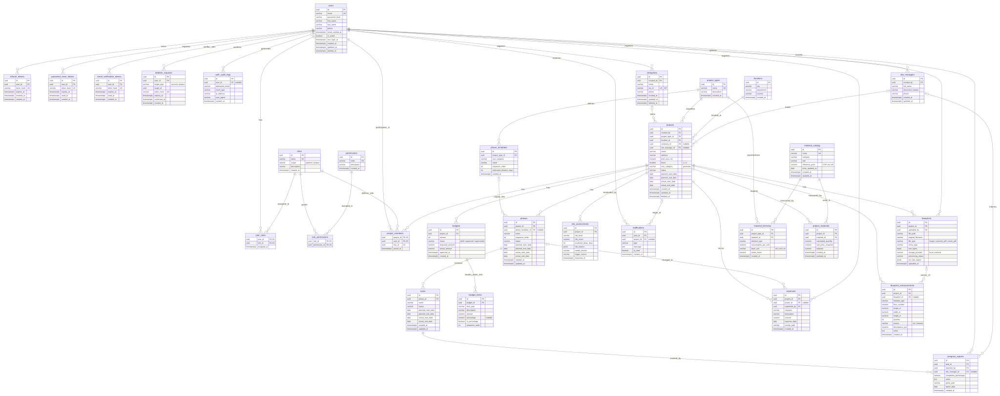

# Base de datos de ObraIA

PostgreSQL con 30 tablas: 10 de autenticación y 20 del dominio (obras, fases, materiales, presupuestos y seguimiento).
En producción la base está en **Neon** (plan gratuito).

## Diagrama entidad-relación

| Archivo | Qué es |
| --- | --- |
| `er-diagram.svg` | Diagrama completo (se puede ampliar sin perder calidad) |
| `er-diagram.png` | El mismo diagrama en imagen |
| `er-diagram.mmd` | Código fuente del diagrama en Mermaid |

## Migraciones

Los scripts que crean la base están en `src/main/resources/db/migration/`. Los ejecuta **Flyway** automáticamente cuando arranca el backend: nunca se corren a mano.

| Archivo | Qué hace |
| --- | --- |
| `V1__create_auth_tables.sql` | 10 tablas de autenticación: usuarios, roles, permisos, tokens, solicitudes de borrado y auditoría |
| `V2__create_domain_tables.sql` | 20 tablas del dominio: obras, planos, fases, tareas, materiales, presupuestos, gastos, riesgos y notificaciones |
| `V3__seed_reference_data.sql` | Datos iniciales en español: roles, permisos, tipos de obra, ciudades, plantillas de fases, materiales y fórmulas |

Flyway anota cada migración aplicada en la tabla `flyway_schema_history`, así cada script se ejecuta una sola vez por base de datos.

## Reglas

1. **Nunca se edita una migración que ya se aplicó.** Flyway guarda una firma de cada archivo y el backend no arranca si cambia. Cualquier cambio va en un archivo nuevo: `V4__descripcion.sql`, `V5__...`.
2. Hibernate trabaja en modo `validate`: revisa que las tablas existan, pero nunca las modifica.
3. Las credenciales de la base van solo en variables de entorno (`.env` en local, panel de Render en producción).

## Convenciones

- Tablas y columnas en inglés, en plural y `snake_case`; los datos (contenido) van en español.
- Llaves primarias `uuid` generadas con `gen_random_uuid()`.
- Fechas en `TIMESTAMPTZ` (se guardan en UTC).
- Estados en inglés con `CHECK` (`planned`, `in_progress`, `delayed`, `completed`); el frontend los traduce.
- Borrado lógico con `deleted_at`.
- Columnas calculadas por la base: `projects.size_category` (pequeña hasta 120 m²) y `project_materials.subtotal`.
